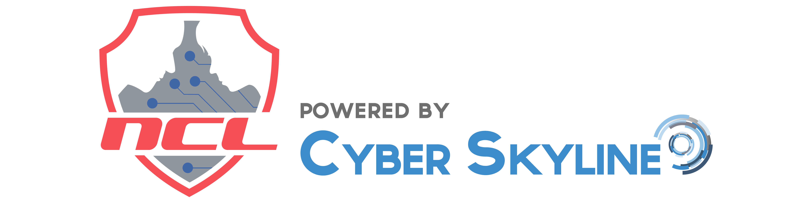
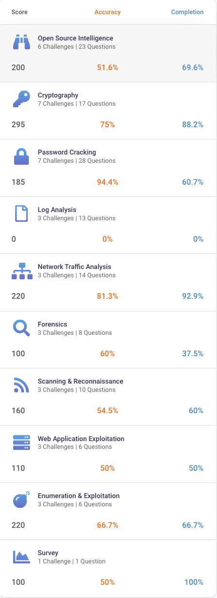

  

<h1 align="center">🛡️ NCL Fall 2024 Individual Game</h1>
<h3 align="center">National Cyber League Capture the Flag | Fall 2024</h3>

  🗓️ Fall 2024 &nbsp; | &nbsp; 🧠 Cyber Defense | Penetration Testing | Threat Analysis &nbsp; | &nbsp; 🏆 Top 12%

---

## 🏁 Overview

I participated in the **National Cyber League Fall 2024 Individual CTF**, competing with over **8,400 cybersecurity enthusiasts** in a timed, real-world CTF environment.

This event focused on a broad range of topics across offensive and defensive security domains.

📌 **Final Rank:** `1038 / 8487`  
📌 **Bracket:** Standard Individual Bracket  
📌 **Scoring Criteria:** Based on score, accuracy, and time of final correct submission.

---

## 📊 Performance Breakdown

| Category                      | Score | Accuracy | Completion |
|-------------------------------|-------|----------|------------|
| 🕵️ Open Source Intelligence   | 200   | 51.6%    | 69.6%      |
| 🔐 Cryptography               | 295   | 75%      | 88.2%      |
| 🔓 Password Cracking         | 185   | 94.4%    | 60.7%      |
| 📄 Log Analysis              | 0     | 0%       | 0%         |
| 🌐 Network Traffic Analysis   | 220   | 81.3%    | 92.9%      |
| 🔬 Forensics                 | 100   | 60%      | 37.5%      |
| 📡 Scanning & Reconnaissance | 160   | 54.5%    | 60%        |
| 🛠️ Web App Exploitation     | 110   | 50%      | 50%        |
| 💣 Enumeration & Exploitation| 220   | 66.7%    | 66.7%      |
| 🧠 Survey                    | 100   | 50%      | 100%       |

---

## 🧠 Skills Demonstrated

- 🔍 Open-source research & intelligence gathering  
- 🧬 Cryptographic analysis & cipher-breaking  
- 💥 Exploitation techniques and enumeration  
- 🌐 Packet analysis & traffic investigation  
- 🔐 Brute-force and hash cracking with tools like **John the Ripper**  
- 🛠️ Web application testing and vulnerability discovery  
- 🧠 Survey-based logic & threat modeling  

---

## 📸 Screenshots

  
📊 Score Breakdown

  

  
🏅 Leaderboard Rank

  

---

## 💡 Takeaways

✅ Gained practical experience simulating real-world cyber incidents  
✅ Improved speed and accuracy in cryptography and network traffic modules  
✅ Recognized areas of growth like **log analysis** for future training  
✅ Competed among **thousands nationwide**, finishing in the **Top 12%**  

---

## 📬 Connect with Me  

💼 [LinkedIn](https://www.linkedin.com/in/marianjohn/)  
🌐 [Portfolio](https://marianjosephjeffrey.com/)  
🛡️ [TryHackMe](https://tryhackme.com/p/mjcube)  
📫 mjcube1999@gmail.com

---

⭐ Proud to be part of the NCL community — learning, hacking, growing! 🚀
